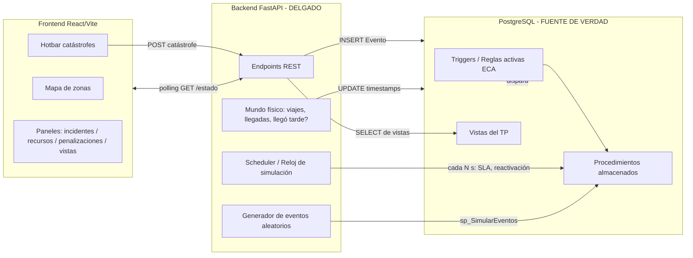
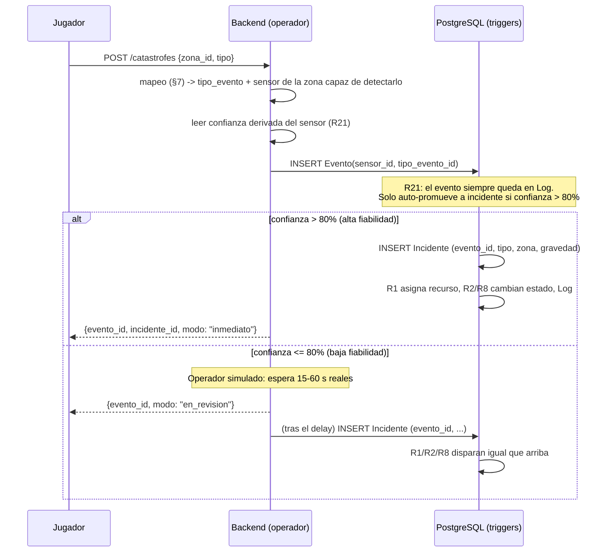

# specs.md — Simulador Visual del Sistema de Gestión de Emergencias (Smart City)

> Proyecto complementario al TP1 de Bases de Datos Avanzadas (UADER – FCyT).
> Capa visual e interactiva sobre la base de datos activa ya existente.
> **Estado: BORRADOR v0.2 — sujeto a iteración.** Las decisiones marcadas con 🔧 son
> ajustables; las marcadas con ⚠️ son riesgos o choques a confirmar con el equipo.

> **Encuadre (importante).** Esto es un **videojuego que vive *por encima* del TP**, no una
> extensión de la consigna. Está permitido **inventar mecánicas "spicy"** mientras se cumpla
> una sola condición dura: **no modificar el esquema de la BD del TP**. La BD mantiene la
> premisa original intacta; el juego agrega capas de simulación arriba (operador humano,
> escala de tiempo, viajes), siempre sin tocar tablas/triggers/procedures existentes.

---

## 1. Contexto del proyecto

El TP1 implementa una base de datos **activa** en PostgreSQL que modela un centro de
monitoreo de emergencias urbanas: detecta incidentes, asigna recursos, escala situaciones,
penaliza demoras y audita todo mediante triggers, procedimientos y vistas (modelo ECA:
Evento → Condición → Acción).

Este proyecto **no reemplaza ni modifica** ese trabajo. Agrega una capa visual e interactiva
—un juego simple tipo Tower Defense 2D— cuyo único fin es **hacer observable, en tiempo real,
el comportamiento autónomo de la base de datos**: que el profesor (y el equipo) vean los
triggers disparándose, los estados cambiando y las reglas aplicándose mientras se juega.

### Principio rector (lo más importante del documento)

> **La base de datos es la única fuente de verdad y dueña de toda la lógica de negocio.
> El juego solo provoca eventos y observa consecuencias. El backend NO reimplementa
> reglas que ya viven en triggers/procedimientos.**

Si el backend duplicara la lógica (decidir él si crea un incidente, a quién asigna, cuándo
penaliza), el juego dejaría de demostrar la base activa y pasaría a demostrar al backend.
Eso vaciaría de sentido al proyecto. Toda decisión de negocio se delega a la BD y el
resultado se **lee de vuelta** (idealmente vía las vistas del TP).

---

## 2. Objetivo

- Visualizar el ciclo completo **catástrofe → señal → detección por sensor → incidente →
  asignación de recurso → atención/penalización → cierre**, todo gobernado por la BD.
- Hacer tangibles reglas que en SQL son invisibles: R21 (confiabilidad de sensores),
  R1/R2 (asignación y cambio de estado), R9 (penalización), R16 (escalado por SLA), etc.
- Servir como apoyo de la **defensa oral** del TP (sección 12 de la consigna).

## 3. Alcance

### Incluido (v1)
- Mapa de ~12 zonas como grafo de nodos conectados.
- Hotbar para generar catástrofes en una zona.
- Detección por sensores según umbral de confianza derivado (R21).
- Panel de incidentes activos, panel de recursos, panel de penalizaciones.
- Movimiento visual simple de recursos entre zonas (punto/ícono que se desplaza).
- Exposición de las vistas del TP dentro de los paneles.
- Carpeta `resources/` para assets (avatares, íconos, sprites, mapas).

### Excluido (no-objetivos)
- ❌ Motor de videojuegos (Unity, Phaser, etc.).
- ❌ Animaciones complejas, físicas, pathfinding real.
- ❌ Reescritura de lógica de negocio fuera de la BD.
- ❌ Autenticación, multiusuario, persistencia de partidas, ranking.
- ❌ Mapa artístico generado por IA en v1 (queda como mejora futura).
- ❌ Narrativa elaborada (es secundaria; ver §16).

---

## 4. Tecnologías propuestas

| Capa | Tecnología | Notas |
|------|-----------|-------|
| Base de datos | PostgreSQL (la del TP) | Levantada con Docker. **Inmutable**: el juego no altera su esquema. |
| Backend | Python 3.11+ + FastAPI | Delgado. Orquestación, scheduler, lectura de vistas. |
| Driver DB | `psycopg` (v3) o SQLAlchemy Core | 🔧 SQLAlchemy Core (no ORM) es suficiente y evita reproducir el modelo. |
| Frontend | React + Vite | SPA simple. |
| Mapa | SVG / `<canvas>` 2D, o `react-flow` para el grafo | 🔧 Empezar con grafo de nodos; estética desacoplada de la lógica. |
| Tiempo real | **Polling** (1–2 s) | Ver §15. SSE como mejora opcional. WebSockets descartado (overkill). |
| Estado frontend | React state / Zustand | Sin Redux. |
| Contenedores | Docker Compose | `db`, `backend`, `frontend`. |

---

## 5. Arquitectura general



**Lectura del diagrama:** el frontend solo dispara catástrofes y pinta el estado. El backend
inserta eventos, simula el mundo físico (viajes/llegadas), actúa de reloj para reglas
temporales y lee vistas. La BD decide *todo* lo demás vía triggers/procedimientos.

---

## 6. Estructura sugerida de carpetas

```
proyecto-simulador/
├── docker-compose.yml
├── specs.md
├── backend/
│   ├── Dockerfile
│   ├── requirements.txt
│   ├── app/
│   │   ├── main.py              # arranque FastAPI + ciclo de vida del scheduler
│   │   ├── config.py            # params de SIMULACIÓN (no de negocio): delays, probs, poll
│   │   ├── db.py                # pool de conexiones a la BD del TP
│   │   ├── routers/
│   │   │   ├── estado.py        # GET /estado (snapshot)
│   │   │   ├── catastrofes.py   # POST /catastrofes
│   │   │   ├── recursos.py
│   │   │   ├── incidentes.py
│   │   │   ├── vistas.py        # GET /vistas/{nombre}
│   │   │   └── simulacion.py    # toggle auto, tick manual
│   │   ├── services/
│   │   │   ├── mapeo.py         # catástrofe -> (sensor, tipo_evento)
│   │   │   ├── operador.py      # baja confianza -> delay 15-60s -> INSERT Incidente
│   │   │   ├── mundo_fisico.py  # timer de viaje vs SLA, llegadas, "llegó tarde"
│   │   │   ├── reloj.py         # reloj simulado (ESCALA_TIEMPO), sim_now()
│   │   │   ├── scheduler.py     # cron: dispara procedures temporales (SLA, reactivación)
│   │   │   └── confianza.py     # confianza derivada de R21 (fallback si no está en la BD)
│   │   └── repositories/        # SOLO SELECT a vistas / INSERT-UPDATE mínimos
│   └── tests/
├── frontend/
│   ├── Dockerfile
│   ├── package.json
│   ├── vite.config.js
│   └── src/
│       ├── main.jsx
│       ├── api/client.js        # wrapper fetch + polling
│       ├── components/
│       │   ├── MapaZonas.jsx
│       │   ├── Hotbar.jsx
│       │   ├── PanelRecursos.jsx
│       │   ├── PanelIncidentes.jsx
│       │   ├── PanelPenalizaciones.jsx
│       │   ├── PanelVistas.jsx
│       │   └── RecursoEnMovimiento.jsx
│       ├── config/
│       │   └── zonas.layout.json # coordenadas x,y de zonas (NUNCA en la BD)
│       └── state/store.js
└── resources/
    ├── avatares/
    ├── iconos/
    ├── sprites/
    └── mapas/
```

> ⚠️ **`zonas.layout.json`**: las coordenadas visuales de las zonas viven en el frontend,
> no en la BD. No contamines el esquema del TP con `x`/`y`.

---

## 7. Modelo de datos relevante (puente juego ↔ BD)

El juego se apoya en estas tablas existentes. **No se crean tablas nuevas.**

| Concepto del juego | Tabla(s) de la BD | Notas |
|---|---|---|
| Zona del mapa | `Zona`, `NivelRiesgo` | ~12 filas. Riesgo afecta prioridad (R13). |
| Sensor en zona | `Sensor`, `TipoSensor` | Confianza derivada de `fecha_instalado`/`fecha_mantenimiento`. |
| Catástrofe (input del jugador) | → `Evento` | NO es un incidente; es la señal cruda. |
| Señal detectada | `Evento`, `TipoEvento` | `Evento(sensor_id, tipo_evento_id, ...)`. |
| Incidente | `Incidente`, `TipoIncidente`, `EstadoIncidente`, `Gravedad` | `evento_id` es **NULL-able** → encaja perfecto: el incidente nace del evento. |
| Recurso | `Recurso`, `TipoRecurso`, `EstadoRecurso` | Estados BD (final): Disponible / Ocupado / Fuera de servicio / En mantenimiento / En tránsito. |
| Zonas habilitadas de un recurso | `ZonaRecurso` | Para R10 (validación de zona). |
| Asignación | `Asignacion` | Timestamps = ciclo de atención (ver §11). |
| Penalización | `Penalizacion`, `TipoPenalizacion` | `puntaje` acumula → bloqueo de recurso. |
| Recurso inhabilitado | `InhabilitacionRecurso` | Historial de bloqueos temporales por penalizaciones y fecha de reactivación R17. |
| Auditoría | `Log` | `tablaAfectada` + `idTablaAfectada` (diseño escalable del equipo). |
| Parámetros de negocio | `ParametrosSistema` | Umbrales que **sí** son regla (ver abajo). |
| Reportes | Vistas del TP | `vIncidentesActivos`, `vRecursosCandidatos`, etc. |

### Estados de recurso (BD) vs. etiqueta visual

> ⚠️ Decisión: **NO agregar estados a `EstadoRecurso`.** Ya tiene 5 estados (CSV final del TP).
> El juego los usa directamente; solo "penalizado/bloqueado" se **deriva** de `Penalizacion`.

| Etiqueta visual | Estado real en BD | Cómo se determina |
|---|---|---|
| Disponible | `Disponible` (1) | Sin asignación activa |
| En tránsito | `En tránsito` (5) | Asignación con `timestamp_llegada IS NULL` |
| Atendiendo | `Ocupado` (2) | `timestamp_llegada` seteado, sin `timestamp_finalizacion` |
| En mantenimiento | `En mantenimiento` (4) | Baja operativa independiente; R17 no la modifica. |
| Penalizado / bloqueado | `Fuera de servicio` (3) | Cantidad de penalizaciones vigentes sobre el máximo configurado |

> Nota: "Ocupado" (2) y "En tránsito" (5) **sí** son estados reales de la BD; "atendiendo" y
> "penalizado" son etiquetas visuales que el frontend resuelve. El cambio de estado lo hace la
> BD (R8); el backend, al simular el viaje, es quien dispara el `UPDATE` que mueve el recurso
> de `En tránsito` (5) a `Ocupado` (2) al registrar `timestamp_llegada`.

### Parámetros: negocio vs. simulación

> ⚠️ Línea divisoria importante:

- **En `ParametrosSistema` (negocio, lo decide la BD):** umbral de confianza (80%), tiempos
  SLA, umbral de capacidad del sistema (R20), puntaje de bloqueo por penalizaciones.
- **En `backend/config.py` (simulación, NO es negocio):**
  - `ESCALA_TIEMPO` (factor de aceleración del reloj simulado; default **20**, ver §15);
  - probabilidad de llegar tarde (10% misma zona / 50% otra zona);
  - rango del delay del **operador humano** para señales de baja confianza (**15–60 s reales**);
  - duración base de los viajes (derivada del SLA), intervalo de polling, período del cron del scheduler.

### Catálogo de catástrofes y mapeo de detección (config de juego)

> Esto vive en **config del juego (backend)**, NO en la BD. La BD no modela qué tipo de sensor
> detecta qué catástrofe; el juego sí, como capa propia. La BD permanece intacta.

**Hotbar — gravedad y cooldown por tipo.** Cada catástrofe trae una **gravedad fija** (la que
después dispara R5/R12/R13/SLA) y un **cooldown**: a mayor gravedad, mayor cooldown (evita
spamear desastres graves). Valores 🔧 ajustables para balance:

| Catástrofe (hotbar) | Gravedad | Cooldown 🔧 |
|---|---|---|
| Falla estructural | 5 | 30 s |
| Incendio | 4 | 20 s |
| Emergencia médica | 4 | 18 s |
| Accidente | 3 | 12 s |
| Evento ambiental | 3 | 10 s |
| Robo | 2 | 8 s |

**Mapeo catástrofe → evento → sensor que lo detecta → incidente.** El backend traduce la
catástrofe a un `TipoEvento`; busca en la zona un sensor cuyo `TipoSensor` sepa emitir ese
evento; si lo hay, inserta el `Evento`; si **no hay sensor capaz**, la zona queda *sin cobertura*
y no se genera evento (ni incidente). Ejemplo ilustrativo (ajustar a las filas semilla reales):

| Catástrofe | `TipoEvento` (ej.) | `TipoSensor` que detecta | `TipoIncidente` (ej.) |
|---|---|---|---|
| Incendio | Humo detectado | Detector de humo | Incendio |
| Robo | Movimiento sospechoso | Cámara | Delito |
| Accidente | Choque detectado | Cámara | Accidente de tránsito |
| Emergencia médica | Pedido de auxilio | Botón de pánico | Emergencia médica |
| Falla estructural | — | *(según seed; puede quedar sin cobertura)* | Falla estructural |
| Evento ambiental | — | *(según seed; puede quedar sin cobertura)* | Evento ambiental |

> El caso "sin cobertura" es **intencional y didáctico**: muestra para qué sirve la distribución
> de sensores. Debe darse feedback visual claro (p. ej. "Zona sin sensor capaz de detectar
> Falla estructural"), no fallar en silencio. La cobertura depende también de la confianza del
> sensor elegido (§11.2): un sensor capaz pero ≤80% genera el evento igual, solo que el
> incidente llega demorado vía operador.

---

## 8. Requisitos funcionales

- **RF1** — El usuario ve un mapa con las ~12 zonas y sus conexiones.
- **RF2** — Cada zona muestra: sensores (con su confianza %), incidentes activos, recursos presentes y estado general.
- **RF3** — El usuario coloca sobre una zona una catástrofe de la hotbar. Cada tipo tiene **gravedad fija** y **cooldown** (a mayor gravedad, mayor cooldown). La hotbar muestra el cooldown en curso.
- **RF4** — La catástrofe genera un `Evento` (no un incidente directo) a través de un sensor de la zona **capaz de detectar ese tipo**. Si ningún sensor de la zona puede detectarla, no se genera evento y se avisa "zona sin cobertura".
- **RF5** — Según la confianza del sensor (R21): si **>80%**, el incidente se crea de inmediato; si **≤80%**, el evento queda registrado (queda su huella en `Log`) y el sistema simula a un **operador humano** que da de alta el incidente tras un delay aleatorio de **15–60 s**. El evento nunca se descarta.
- **RF6** — Los incidentes aparecen en el panel de incidentes activos con: tipo, zona, estado, tiempo desde detección, recursos asignados, modo de detección (inmediato / vía operador), penalizaciones asociadas.
- **RF7** — El panel de recursos agrupa por etiqueta visual (disponible / en tránsito / atendiendo / en mantenimiento / penalizado).
- **RF8** — Al asignarse un recurso (por la BD), se anima su movimiento desde su zona hacia la del incidente.
- **RF9** — El backend simula la llegada (a tiempo o tarde); si llega tarde, la BD penaliza y el juego lo notifica visualmente.
- **RF10** — El panel de penalizaciones muestra penalizaciones recientes, conectadas a filas reales de `Penalizacion`.
- **RF11** — Los paneles exponen vistas del TP (al menos `vIncidentesActivos`, `vRecursosDisponibles`, `vIncidentesCriticos`, `vRecursosPenalizados`, `vZonasIncidentadas`).
- **RF12** — Modo "auto": el sistema genera eventos aleatorios periódicamente (vía `sp_SimularEventos`).
- **RF13** — El usuario puede pausar/reanudar la simulación.

## 9. Requisitos técnicos

- **RT1** — El backend no contiene lógica de negocio duplicada de la BD (ver §1).
- **RT2** — Todo cambio de estado se confirma **leyendo de vuelta** la BD (preferentemente vistas).
- **RT3** — La conexión a la BD usa un pool; las escrituras del juego se limitan a `INSERT Evento` y a los `UPDATE` de timestamps que representan el mundo físico.
- **RT4** — El cálculo de confianza de sensor (R21) se hace **en la BD** (función/vista) si ya existe; si no, el backend lo replica como *fallback* documentado.
- **RT5** — Las reglas temporales (SLA/reactivación) se disparan desde el scheduler del backend llamando a procedimientos, no se reimplementan.
- **RT6** — El frontend es agnóstico a la estética: la lógica de render no depende de si el mapa es grafo o imagen.
- **RT7** — CORS habilitado solo para el origen del frontend; sin secretos en el cliente.
- **RT8** — Todo el stack levanta con `docker compose up`.

---

## 10. Reglas de negocio (mapeadas a las reglas activas del TP)

El juego **provoca** las condiciones; la BD ejecuta la regla. Reglas observables:

| Regla TP | Qué la dispara en el juego | Qué se ve |
|---|---|---|
| **R21** Confianza de sensores | Catástrofe → Evento de un sensor | Si >80%: incidente inmediato. Si ≤80%: incidente demorado (15–60 s) vía operador simulado |
| **R1** Asignación automática | Incidente creado | Aparece recurso asignado |
| **R2/R8** Cambio de estado | Asignación creada | Incidente → "En proceso"; recurso → Ocupado |
| **R5** Asignación múltiple | Catástrofe de alta gravedad | Varios recursos al mismo incidente |
| **R9/P4** Penalización | Llegada tarde (mundo físico) | Notificación + fila en panel de penalizaciones |
| **R10** Validación de zona | Asignación a recurso no habilitado | Asignación rechazada (recurso no elegible) |
| **R12/R13** Priorización | Incidente en zona de alto riesgo | Mayor prioridad mostrada |
| **R14** Mejor recurso | Asignación | Recurso elegido vía `vRecursosCandidatos` |
| **R16** Escalado por SLA | Paso del tiempo (scheduler) | Incidente → "Escalado" |
| **R17** Reactivación | Paso del tiempo (scheduler) | Recurso "Fuera de servicio" → Disponible |
| **R20** Capacidad | Muchos incidentes simultáneos | Nuevos incidentes → "En espera" |
| **R7** Cierre automático | Todos los recursos finalizan | Incidente → "Resuelto" |
| **R3/R18/R19** Auditoría | Cualquier acción | Entradas en `Log` (mostrables en panel) |

---

## 11. Flujos

### 11.1 Flujo principal del juego

1. El frontend pide `GET /estado` y pinta mapa, sensores, recursos, incidentes.
2. El jugador genera una catástrofe (o el modo auto la genera).
3. El backend traduce la catástrofe a un `Evento` y lo inserta.
4. La BD reacciona (R21 → ¿incidente?; R1/R2 → asignación; etc.).
5. El backend simula viajes y, vía scheduler, dispara reglas temporales.
6. El frontend, por polling, refleja todos los cambios.
7. Los incidentes se resuelven (R7) y los recursos se liberan; el ciclo continúa.

### 11.2 Flujo de detección: catástrofe → incidente (R21 + operador simulado)



> **Mecánica (resuelta con el equipo).** El evento **nunca se destruye**: siempre deja su
> huella en `Log` (R21 intacta). La diferencia es el *tiempo* hasta que nace el incidente:
> - **Confianza >80%:** la BD lo promueve sola, al instante.
> - **Confianza ≤80%:** la BD no lo promueve (solo Log). El backend, **actuando como el
>   operador humano de la ciudad**, espera un random de **15–60 s** y luego inserta el
>   `Incidente` (la FK `evento_id` NULL-able lo permite). A partir de ahí, R1/R2/R8 corren igual.
>
> Esto simula que un sensor poco fiable hace que el sistema "dude" y tarde más en reaccionar,
> sin introducir falsos positivos (no se descartan eventos ni se inventan incidentes falsos).
> El jugador **no confirma nada**: él solo causa catástrofes (input); la duda y la resolución
> son del sistema. No se modifica la BD: el operador es lógica de juego que inserta datos,
> no esquema.

### 11.3 Flujo de asignación y movimiento de recursos

1. Al insertar el incidente, un **trigger AFTER INSERT** crea la `Asignacion` (R1) eligiendo recurso vía `vRecursosCandidatos` (R14) respetando zona (R10), y pone el recurso en `En tránsito` (5) (R8). El backend no interviene en esta decisión.
2. El backend (mundo físico) genera un **timer de viaje** en función del SLA del incidente, con probabilidad de superarlo:
   - recurso en la **misma zona** del incidente → 10% de chance de que el timer supere el SLA;
   - recurso en **otra zona** → 50% de chance de superarlo.
   Los tiempos se calculan en escala simulada (§15), así que un viaje "largo" se ve en segundos reales.
3. Al cumplirse el timer, el backend setea `timestamp_llegada` y `estado_exito`, y el recurso pasa a `Ocupado` (2). Etiqueta visual = **atendiendo**.
4. Si la llegada superó el SLA, la BD genera la `Penalizacion` (R9/P4).
5. Al finalizar, se setea `timestamp_finalizacion`; cuando todos los recursos finalizan, R7 cierra el incidente y los libera (vuelven a `Disponible`).

### 11.4 Manejo de penalizaciones

- La penalización **siempre** nace de una fila real en `Penalizacion` creada por la BD (nunca solo visual).
- El frontend la detecta al hacer polling (delta en `vRecursosPenalizados` / `Penalizacion`) y muestra:
  - toast/notificación inmediata,
  - entrada persistente en el panel de penalizaciones,
  - cambio de etiqueta del recurso a "penalizado" si el puntaje acumulado lo bloquea.

---

## 12. Interacción con la base de datos (división de responsabilidades)

| Acción | ¿Quién? | Operación |
|---|---|---|
| Crear señal de catástrofe | Backend | `INSERT Evento` |
| Promover evento (>80%) a incidente | **BD (trigger R21)** | — |
| Promover evento (≤80%) tras delay | Backend (operador simulado) | `INSERT Incidente` luego de 15–60 s |
| Asignar recurso | **BD (R1/R14)** | — |
| Cambiar estados | **BD (R2/R8)** | — |
| Simular viaje y llegada | Backend (mundo físico) | `UPDATE Asignacion.timestamp_llegada, estado_exito` |
| Penalizar | **BD (R9/P4)** | — |
| Escalar por SLA / reactivar recurso | Backend (cron) dispara, **BD ejecuta** | `CALL sp_EscalarIncidente` / proc. de reactivación |
| Generar eventos aleatorios | Backend (cron) dispara, **BD ejecuta** | `CALL sp_SimularEventos` |
| Leer estado para render | Backend | `SELECT` sobre vistas |

> **Sobre las reglas temporales:** en el TP estos procedures se ejecutan **a mano** (acordado
> con el profe para no usar crons). En el videojuego sí se permite cron: el scheduler del
> backend los invoca periódicamente. Es el mismo procedure, disparado de otra forma.

> Si alguna de estas decisiones (R21, R1, R9...) hoy **no** está como trigger/proc en la BD
> sino pendiente de implementar, hay que definir si el juego la asume existente o si el
> backend la cubre temporalmente. **Pregunta abierta para el equipo (ver §17).**

---

## 13. Endpoints tentativos del backend

| Método | Ruta | Descripción |
|---|---|---|
| `GET` | `/estado` | Snapshot completo para render (zonas, sensores+confianza, incidentes, recursos, penalizaciones recientes). |
| `GET` | `/zonas` | Zonas con resumen. |
| `GET` | `/sensores` | Sensores con confianza derivada (R21). |
| `POST` | `/catastrofes` | `{zona_id, tipo_catastrofe}` → inserta Evento; responde si fue promovido. |
| `GET` | `/incidentes/activos` | Wrapper de `vIncidentesActivos`. |
| `GET` | `/recursos` | Recursos con etiqueta visual derivada. |
| `GET` | `/penalizaciones/recientes` | Wrapper de `vRecursosPenalizados` / `Penalizacion`. |
| `GET` | `/eventos/recientes` | Incluye señales descartadas (desde `Log`). |
| `GET` | `/vistas/{nombre}` | Expone cualquier vista del TP (lista blanca de nombres permitidos). |
| `POST` | `/simulacion/auto` | `{activo: bool}` → modo eventos aleatorios. |
| `POST` | `/simulacion/tick` | Tick manual del reloj (para demos controladas). |
| `POST` | `/simulacion/pausa` | Pausa/reanuda el reloj y los timers. |
| `GET` | `/eventos/en-revision` | Eventos de baja confianza esperando al operador (con countdown). |

> ⚠️ `/vistas/{nombre}` debe validar `{nombre}` contra una **lista blanca** (evitar
> inyección / lectura arbitraria).

---

## 14. Componentes principales del frontend

- **`MapaZonas`** — grafo de nodos (zonas) y aristas (conexiones). Lee `zonas.layout.json`.
- **`NodoZona`** — badge con sensores, incidentes activos, recursos y nivel de riesgo.
- **`Hotbar`** — barra inferior con tipos de catástrofe (cada uno con gravedad y cooldown); selección + click en zona. Muestra el cooldown activo por tipo.
- **`PanelRecursos`** (izquierda) — agrupado por etiqueta visual derivada.
- **`PanelIncidentes`** (derecha) — incidentes activos + señales pendientes/descartadas.
- **`PanelPenalizaciones`** — penalizaciones recientes + notificaciones.
- **`PanelVistas`** — selector que renderiza cualquier vista del TP como tabla.
- **`RecursoEnMovimiento`** — punto/ícono interpolado entre dos nodos durante el tránsito.
- **`api/client.js`** — fetch + loop de polling con cancelación.
- **`state/store.js`** — estado global (snapshot + selección de hotbar).

---

## 15. Modelo de tiempo y mecanismo de tiempo real

### Escala de tiempo: reloj simulado acelerado ⚠️
No se puede jugar en tiempo real: nadie espera 10 min a que llegue una ambulancia ni días a
que un sensor se rehabilite. Solución: un **reloj simulado** que avanza más rápido que el real,
escribiendo **fechas realistas** en la BD para que los procedures comparen timestamps sin
enterarse de que están acelerados.

- **Factor:** `ESCALA_TIEMPO = 20` (1 segundo real = 20 segundos simulados). 🔧 Configurable.
- **Reloj:** `sim_now = sim_inicio + (real_now − real_inicio) × ESCALA_TIEMPO`.
- Todos los timestamps que el backend escribe (Evento, llegadas, finalizaciones) usan `sim_now`.
- Los procedures de SLA/escalado comparan timestamps en tiempo simulado → funcionan tal cual.

**Equivalencias con factor 20:**

| SLA (negocio, realista) | Tiempo simulado | Espera real del jugador |
|---|---|---|
| 10 min | 600 s sim | **30 s reales** |
| 5 min | 300 s sim | **15 s reales** |
| 2 min | 120 s sim | 6 s reales |

- **Confianza de sensores (semanas):** no se "ve decaer" en vivo (sería demasiado lento aun con
  20×). Se resuelve sembrando sensores con distintas `fecha_mantenimiento` para que **hoy** ya
  tengan confianzas variadas (algunos >80%, otros ≤80%). Esto alimenta el flujo §11.2.
- **Cron del scheduler:** corre en tiempo real (p. ej. cada 1–2 s) y en cada vuelta llama a los
  procedures temporales (SLA, reactivación) usando el reloj simulado para las comparaciones.

### Tiempo real frontend
**Polling cada 1–2 s** sobre `GET /estado`. Razones: trivial, robusto, sin estado de conexión,
perfecto para ~12 zonas y pocos incidentes. **SSE** queda como mejora opcional si se quiere push
sin recargar. **WebSockets descartado**: complejidad innecesaria para esta escala.

---

## 16. Recursos gráficos: sprites, mapa y narrativa

La estética es una **capa de pintura** que se enchufa sobre el grafo de nodos sin tocar el
backend. Regla rectora: **la estética está desacoplada de la lógica**, y **el estado nunca se
hornea en el sprite** (se pinta por encima con overlays programáticos).

### Mapa por capas (recomendado) — NO un mapa monolítico
Un único PNG de mapa generado por IA es un anti-patrón aquí: no permite controlar la posición
ni el etiquetado de las 12 zonas, no se le puede enganchar interacción/estado a una región, y
deja de coincidir con `zonas.layout.json` si algo cambia. En su lugar, 3 capas:

1. **Fondo decorativo** (opcional): imagen IA de "base urbana" ambiental (calles, río, parques),
   *sin* zonas marcadas. Solo decoración.
2. **Tiles de zona** (lo central): ~12 sprites de distrito en estilo consistente, ubicados por
   coordenadas (`zonas.layout.json`). Cada zona es un elemento React/SVG interactivo.
3. **Conexiones**: líneas SVG dibujadas por código entre coordenadas (no pintadas en la imagen).

**Estado por overlay:** el tile de zona es neutro; incendio/incidente/penalización se muestran
con tinte, ícono o anillo pulsante encima. Evita la explosión combinatoria sprite×estado. Por
eso los tiles deben tener paleta tranquila para que los colores de estado resalten.

### Personajes (intro/tutorial)
Dos sprites tipo busto, fondo transparente, mismo estilo que los tiles:
- **Intendente** (profe de práctica caricaturizado) y **ViceIntendente** (profe de teoría).
- En la primera partida, saludan y guían el tutorial vía cuadro de diálogo superpuesto.
- El "ya vi el tutorial" se persiste con un flag simple en `localStorage` (app Vite real).
- El avatar de operador puede reusarse para mensajes contextuales del flujo §11.2
  ("Sensor de Zona 4 al 75%: baja confianza, revisando antes de dar de alta…").

### Producción de assets (tips)
- Prompt de estilo corto y **reutilizado idéntico** en los 12 tiles para coherencia.
- PNG con transparencia, mismo encuadre/tamaño, generados a 2× para nitidez.
- Nombres predecibles (`zona_01.png`, `intendente.png`, …) en `resources/`.

La narrativa es **secundaria**: no invertir tiempo en arte hasta que el núcleo (grafo + flujos)
funcione.

---

## 17. Decisiones abiertas (a confirmar con el equipo) ⚠️

1. **¿Las reglas activas clave (R21, R1, R9, R16...) ya están implementadas como
   triggers/procedimientos en la BD?** De esto depende cuánto cubre el backend temporalmente.
2. ✅ **Resuelto** — Señal sub-umbral: no se descarta; el operador simulado da de alta el
   incidente tras 15–60 s. El evento siempre queda en `Log`.
3. ✅ **Resuelto** — Escala de tiempo: reloj simulado con `ESCALA_TIEMPO = 20` (fechas
   realistas, paso acelerado). Confianza vía seed data.
4. ✅ **Resuelto** — Asignación: la dispara un **trigger AFTER INSERT en `Incidente`** (R1).
   El usuario nunca asigna recursos; la BD lo hace sola. El backend no llama a `sp_AsignarRecurso`.
5. ✅ **Definido** — Mapeo catástrofe → evento → sensor → incidente: vive como **config de
   juego** (no en la BD), con catálogo de gravedad/cooldown y cobertura por tipo de sensor
   (§7). Pendiente menor: completarlo con los `id`/nombres reales de las filas semilla de
   `TipoSensor`, `TipoEvento` y `TipoIncidente`.

---

## 18. Restricciones

- El esquema de la BD del TP **no se modifica** (solo lectura + escrituras mínimas: Evento, Incidente del operador, y timestamps de Asignación).
- **El usuario nunca asigna recursos manualmente:** la asignación es 100% de la BD (trigger R1). El jugador solo genera catástrofes.
- Sin motor de juego; render 2D simple.
- Sin librerías de IA en runtime; las imágenes IA se generan offline y se guardan en `resources/`.
- Stack reproducible con Docker Compose.
- Red del backend solo hacia la BD; CORS restringido al frontend.

## 19. Supuestos

- La BD del TP es funcional y contiene datos semilla coherentes (~12 zonas, sensores, recursos, tipos).
- Las vistas del TP existen y devuelven los datos esperados.
- El equipo puede sembrar `fecha_mantenimiento` variada para los sensores.
- Un solo usuario juega a la vez (sin concurrencia de jugadores).

## 20. Ideas futuras / mejoras opcionales

- Mapa 2D artístico (imagen IA) sustituyendo el grafo, sin tocar la lógica.
- SSE/WebSockets si se necesita push instantáneo.
- Línea de tiempo / "rewind" de eventos para análisis post-mortem en la defensa.
- Rebalanceo de recursos (R15) visualizado — ⚠️ R15 choca con R10 (el propio equipo lo notó);
  resolver esa contradicción antes de implementarlo.
- Panel de "explicación de trigger": al ocurrir un cambio, mostrar qué regla lo causó (leyendo `Log`).
- Métricas: tiempo medio de respuesta, % de incidentes escalados, recursos más penalizados.

---

## 21. Riesgos y simplificaciones (lectura crítica)

| # | Riesgo / sobre-ingeniería | Recomendación |
|---|---|---|
| 1 | Backend reimplementa lógica de la BD | Mantenerlo delgado; leer siempre de vuelta de la BD (§1). |
| 2 | Confundir "operador" con confirmación del jugador | El operador es del sistema (backend), automático; el jugador solo causa catástrofes. |
| 3 | Agregar estados de recurso a la tabla | No hace falta: la BD ya tiene 5 estados. Solo "penalizado" se deriva. |
| 4 | Reglas temporales como triggers | Imposible: usar scheduler del backend que llama procedimientos. |
| 5 | Esperar semanas para ver R21 | Seed con `fecha_mantenimiento` variada. |
| 6 | WebSockets / animaciones complejas | Polling + interpolación simple. |
| 7 | Coordenadas de zonas en la BD | Mantenerlas en `zonas.layout.json` del frontend. |
| 8 | Mapa IA y narrativa primero | Dejarlos para el final; el núcleo es la BD. |
| 9 | Probabilidad de "llegar tarde" tratada como regla de BD | Es física simulada → config del backend, no `ParametrosSistema`. |
| 10 | R15 (rebalanceo) vs R10 (zona) | Contradicción conocida: no implementar hasta resolverla. |

---

## 22. Modo Tormenta (opcional, simulador aparte)

> **No obligatorio.** Modo separado del juego principal; se implementa solo si sobra tiempo.

Un simulador de estrés que dispara muchas catástrofes de golpe (o a alta frecuencia) para:
- demostrar la **simulación obligatoria del TP** de ≥20 incidentes simultáneos (consigna §9);
- activar **R20** (capacidad: nuevos incidentes → "En espera") de forma visible;
- estresar la asignación y ver penalizaciones en masa.

Diseño sugerido: un endpoint `POST /simulacion/tormenta {cantidad, intensidad}` que en el
backend encola N catástrofes con distribución de tipos/zonas, respetando el mismo flujo §11
(no es un atajo que evada la BD). Vive como pantalla/modo aparte para no ensuciar el juego base.
